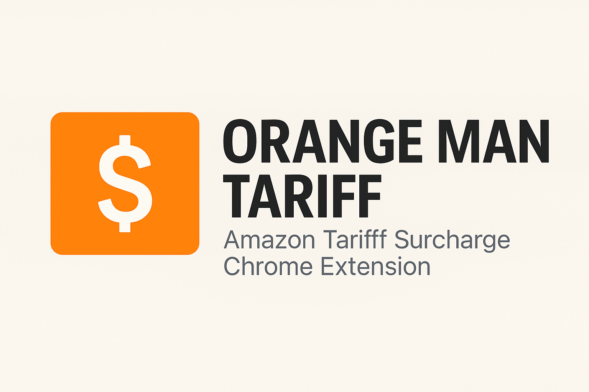

# 🟧 Orange Man Tariff — Amazon Tariff Surcharge Chrome Extension

Ever wondered how much more you’re really paying due to U.S. tariffs on Chinese goods?
**Orange Man Tariff** adds a clear, no-nonsense surcharge label to Amazon product pages, revealing the hidden costs caused by import tariffs — right next to the price.

### 📦 What It Does

This lightweight Chrome extension identifies products on Amazon that are:

* **Shipped from China**
* **Part of tariffed categories under current U.S. trade policy**

When both conditions are met, it calculates and **displays the estimated tariff surcharge** directly on the product page, giving you transparency that Amazon doesn’t.

---

## 🚀 Getting Started

### 1. Install the Extension Manually

Until it's added to the Chrome Web Store, here's how to install it locally:

1. Open Chrome and navigate to: `chrome://extensions`
2. Toggle **Developer mode** on (top right)
3. Click **Load unpacked**
4. Select the folder where you’ve cloned or downloaded this extension

### 2. Use It on Amazon

* Visit any Amazon product page.
* If the item is **shipped from China** and subject to tariffs, the extension will show a **tariff surcharge** label next to the price.

---

## 📊 Why This Matters

U.S. tariffs on Chinese imports — sometimes as high as **145%** — quietly raise consumer prices.
Yet platforms like Amazon rarely disclose this.
This extension aims to fix that.

🔍 No politics. Just price transparency.

---

## 👨‍💻 Built by [DC Made Media](https://dcmademedia.com)

We build tools that help users see through the noise.
Have a feature idea, bug report, or a broader transparency project in mind? [Let’s talk](https://dcmademedia.com).

---

## 🛡 Disclaimer

This extension uses best-available public data to estimate tariff categories and rates.
It is not affiliated with or endorsed by Amazon, the U.S. government, or any political party.

---